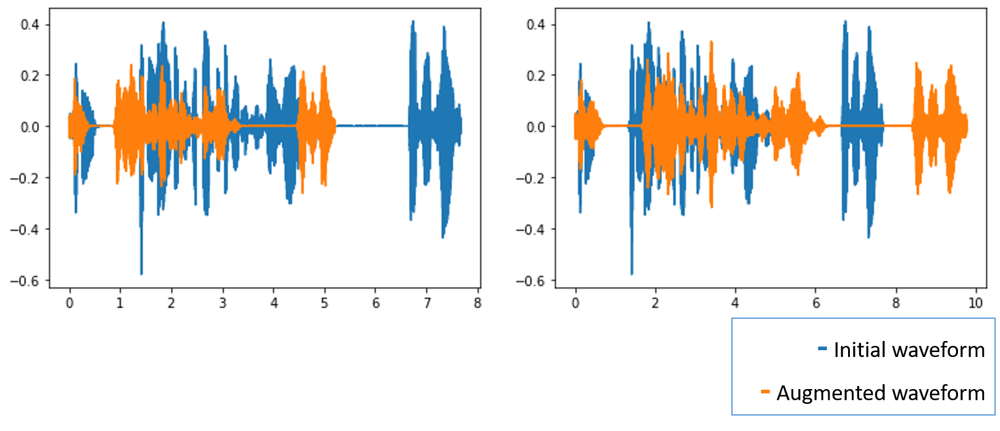
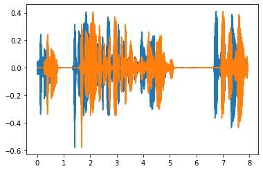
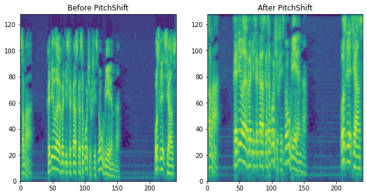
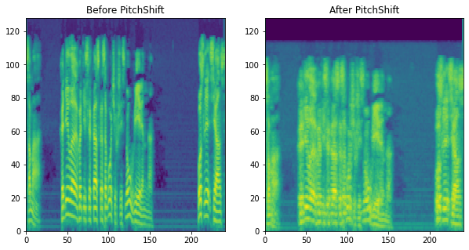
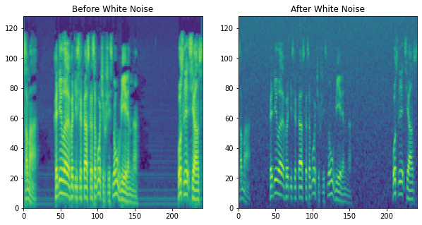
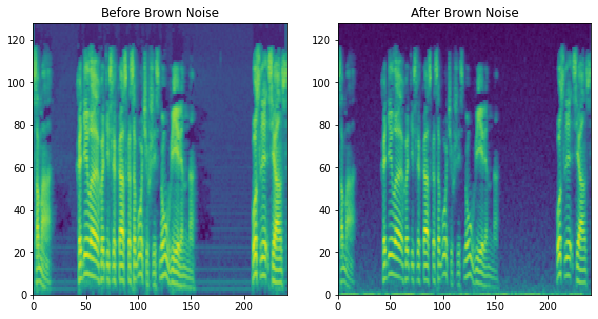
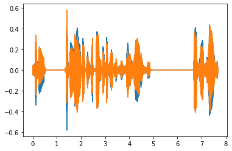

# speechaugs
Augmentations for single-channel *waveforms* for *speech recognition* models.
***
### Augmentations:
* Time Stretch
* Forward Time Shift
* Pitch Shift
* Colored Noise (white, pink, brown, blue, violet, grey)
* Zero Samples
* Clipping samples
* Inversion
***
## Installation
`pip install speechaugs`
***
## Time Stretch
Stretch a wavefom in time with randomly chosen rate. Is implemented using <a href="https://librosa.org/doc/main/generated/librosa.effects.time_stretch.html"> *librosa.effects.time_stretch*</a>. 
<p>
 
</p>

## Forward Time Shift
Shift a waveform forwards in time.
<p>
 
</p>

## Pitch Shift
Shift a pitch by *n_steps* semitones. Is implemented using <a href="https://librosa.org/doc/main/generated/librosa.effects.pitch_shift.html"> *librosa.effects.pitch_shift*</a>. 

The work of PitchShift can be better illustrated on the MelSpectrograms of waveforms. 

**Higher pitch (+9 semitones):**
<p>
 
</p>

**Lower pitch (-5 semitones)**
<p>
 
</p>

## Colored Noise
Color of noise depends on the spectral density of the noise. You can go to <a href="https://en.wikipedia.org/wiki/Colors_of_noise">wiki page</a> for more information.

This class is implemented using <a href="https://github.com/felixpatzelt/colorednoise">colorednoise package</a>. The color of noise is randomly choosen.

**White Noise**
<p>
 
</p>

**Brown Noise**
<p>
 
</p>

## Zero Samples
Set some percentage of samples to zero.
## Clipping Samples
Clip some percentage of samples from a waveform.
<p>
 
</p>

## Inversion
Change sign of waveform samples.
<p>
 
</p>

***
## Usage example
Import:
```python
from speechaugs import TimeStretchLibrosa, ForwardTimeShift, PitchShiftLibrosa, ColoredNoise, Inversion, ZeroSamples, ClippingSamples
    
import torch, torchaudio
import albumentations as A
```
Usage:
```python

ex_waveform, sr = torchaudio.load('audio_filename')

transforms = A.Compose([
    ForwardTimeShift(p=0.5),
    Inversion(p=0.5),
    A.OneOf([ZeroSamples(p=0.5), ClippingSamples(p=0.5)], p=0.5),
    A.OneOf([TimeStretchLibrosa(p=0.5), PitchShiftLibrosa(p=0.5)], p = 0.5),
    ColoredNoise(p=0.5)
], p=1.0)

augmented = transforms(waveform=ex_waveform)['waveform']
```